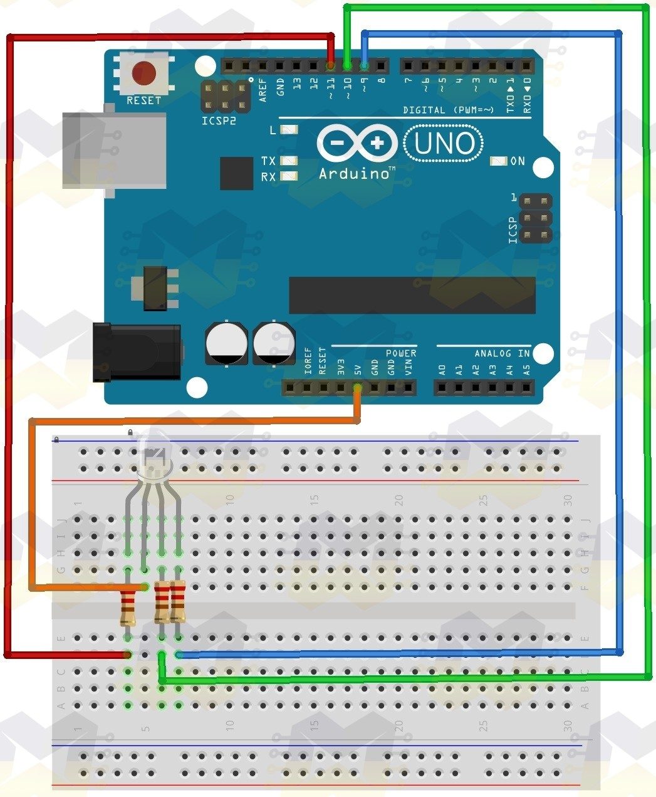
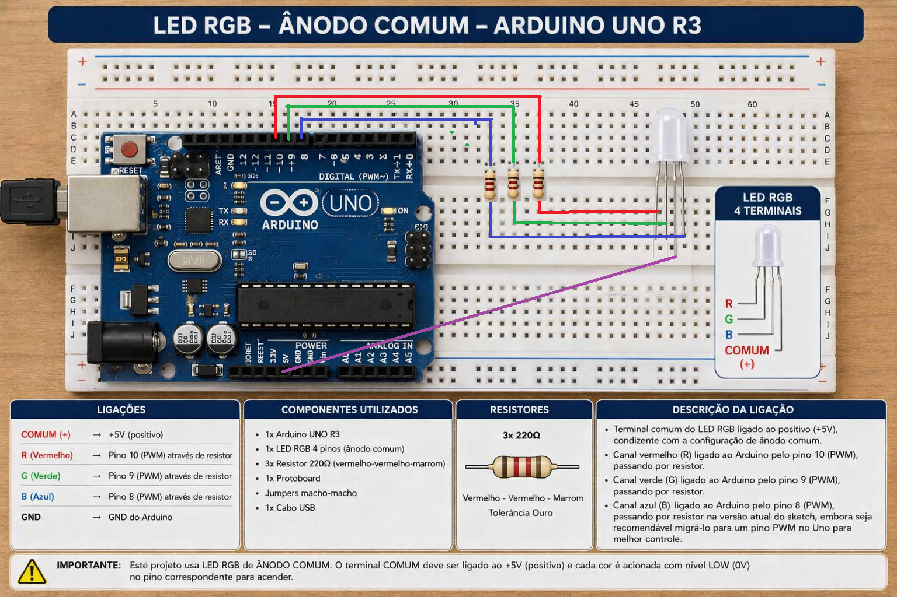

# uno_rgb_led_intro

Projeto introdutório com Arduino Uno R3 e LED RGB, criado para demonstrar de forma simples o controle independente dos canais vermelho, verde e azul por software. O sketch alterna automaticamente entre várias cores usando os pinos digitais 10, 9 e 8 definidos no código enviado, com lógica preparada para LED RGB de ânodo comum por meio da diretiva `#define COMMON_ANODE`.

Este experimento é uma boa porta de entrada porque reúne conceitos fundamentais de eletrônica e programação embarcada: uso de saídas digitais/PWM, montagem em protoboard, resistores de limitação de corrente e composição de cores em um único componente.

<div>
<p align="center">
  
</p>
</div>

## Objetivo

O objetivo deste projeto é acender um LED RGB em diferentes cores de forma automática, usando um Arduino Uno R3 como controlador. Além de servir como exemplo inicial para quem está começando com Arduino, ele ajuda a entender como três canais de cor podem ser combinados para gerar diferentes efeitos visuais.

## Componentes utilizados

| Componente             | Quantidade | Observação                                                                                                                         |
| ---------------------- | ----------:| ---------------------------------------------------------------------------------------------------------------------------------- |
| Arduino Uno R3         | 1          | Placa principal do projeto.                                                                                                        |
| LED RGB de 4 terminais | 1          | O sketch foi escrito para **ânodo comum** por padrão.                                                                              |
| Resistores             | 3          | Um resistor em série para cada canal de cor; valores típicos entre 220 ohms e 330 ohms são apropriados para esse tipo de montagem. |
| Protoboard             | 1          | Usada para a montagem sem solda.                                                                                                   |
| Jumpers                | Alguns     | Para interligar Arduino, resistores e LED RGB.                                                                                     |
| Cabo USB               | 1          | Para alimentação e gravação do sketch.                                                                                             |

## Funcionamento do circuito

O LED RGB possui três canais internos independentes: vermelho, verde e azul. No projeto, cada canal é ligado a um pino do Arduino por meio de resistor, enquanto o terminal comum do LED é ligado à alimentação, conforme indicado pela montagem anexada e pela lógica de `COMMON_ANODE` presente no sketch.

A distribuição adotada no código é a seguinte:

- Pino 10: canal vermelho.
- Pino 9: canal verde.
- Pino 8: canal azul.

Os resistores têm papel importante porque limitam a corrente em cada canal do LED, protegendo tanto o componente quanto os pinos do microcontrolador. Sem esses resistores, o LED poderia receber corrente excessiva e sofrer dano permanente.

## Observação importante sobre PWM

No Arduino Uno, os pinos com PWM nativo são 3, 5, 6, 9, 10 e 11. Isso significa que os pinos 9 e 10 suportam `analogWrite()`, mas o pino 8 não possui PWM por hardware na placa Uno.

Como o sketch enviado usa `analogWrite(pinoB, azul);` no pino 8, o canal azul não terá controle analógico real no Arduino Uno R3 e tenderá a funcionar apenas como ligado/desligado, dependendo da implementação usada pela plataforma. Para funcionamento plenamente consistente com mistura suave de cores, o ideal é mover o canal azul para um pino PWM como 11, 6, 5 ou 3.

Uma configuração mais apropriada no Uno seria:

```cpp
int pinoR = 10;
int pinoG = 9;
int pinoB = 11;
```

Com isso, os três canais passam a aceitar `analogWrite()` corretamente no Arduino Uno R3

## Explicação do sketch

O programa começa declarando os pinos ligados aos terminais de cor do LED RGB:

```cpp
int pinoR = 10;
int pinoG = 9;
int pinoB = 8;
```

Em seguida, a diretiva abaixo informa ao programa que o LED utilizado é do tipo ânodo comum:

```cpp
#define COMMON_ANODE
```

Nesse tipo de LED, o terminal comum vai ao positivo da alimentação e cada canal de cor é ativado quando o Arduino aplica um nível mais baixo relativo ao circuito. Por isso, a função `setColor()` inverte os valores recebidos, usando `255 - valor`, antes de chamar `analogWrite()`. Essa inversão faz com que a lógica do código continue intuitiva: `setColor(255, 0, 0)` ainda significa “vermelho máximo”, mesmo em LED de ânodo comum.

No `setup()`, os três pinos são configurados como saída:

```cpp
pinMode(pinoR, OUTPUT);
pinMode(pinoG, OUTPUT);
pinMode(pinoB, OUTPUT);
```

No `loop()`, o sketch percorre uma sequência de cores predefinidas com pausas usando `delay()`. Entre elas estão vermelho, verde, azul, amarelo, violeta e azul aqua.

## Como a função `setColor()` trabalha

A função abaixo recebe três valores de intensidade, um para cada canal de cor:

```cpp
void setColor(int vermelho, int verde, int azul)
```

Cada argumento varia de 0 a 255, seguindo a convenção do `analogWrite()`. Quanto maior o valor, maior é a intensidade desejada para aquele canal. Quando se trata de LED de ânodo comum, o código inverte esses números antes da escrita nos pinos.

Exemplos presentes no sketch:

- `setColor(255, 0, 0)` produz vermelho.
- `setColor(0, 255, 0)` produz verde.
- `setColor(0, 0, 255)` produz azul.
- `setColor(255, 255, 0)` produz amarelo pela combinação de vermelho e verde.
- `setColor(0, 255, 255)` produz azul aqua pela combinação de verde e azul.

## Montagem

<div>
<p align="center">
  
</p>
</div>

A imagem representa a montagem do projeto em protoboard com o Arduino Uno R3, os três resistores e o LED RGB de 4 terminais. 

- Terminal comum do LED RGB ligado ao positivo, condizente com a configuração de ânodo comum usada no código.
- Canal vermelho ligado ao Arduino pelo pino 10, passando por resistor.
- Canal verde ligado ao Arduino pelo pino 9, passando por resistor.
- Canal azul ligado ao Arduino pelo pino 8, passando por resistor na versão atual do sketch, embora seja recomendável migrá-lo para um pino PWM no Uno para melhor controle.

## Como usar

1. Monte o circuito na protoboard conforme a ilustração anexada.
2. Abra a Arduino IDE.
3. Cole o sketch do projeto.
4. Se estiver usando LED RGB de cátodo comum, comente a linha `#define COMMON_ANODE`.
5. Grave o código na placa Arduino Uno R3.
6. Observe a sequência automática de cores no LED RGB.

## Sugestões de melhoria

Este projeto pode evoluir facilmente para versões mais ricas e didáticas, por exemplo:

- Trocar o pino azul para um pino PWM real no Uno, como o 11.
- Remover os `delay()` e implementar transições suaves com `millis()`.
- Criar efeitos de fade entre cores.
- Adicionar botão para alternar entre modos de iluminação.
- Integrar potenciômetros para controlar manualmente os canais RGB.

## Estrutura sugerida no repositório

```text
uno_rgb_led_intro/
├── README.md
├── uno_rgb_led_intro.ino
└── LED_RGB_UNO.png
└── UNO_RGB_LED.png
```

## Conclusão

O `uno_rgb_led_intro` é um projeto inicial com vistas a apresentar, de forma visual e simples, conceitos básicos de eletrônica com Arduino. Ele ajuda a entender o uso de resistores, a ligação de um LED RGB, a diferença entre ânodo comum e cátodo comum e o princípio de mistura de cores controlada por software.
