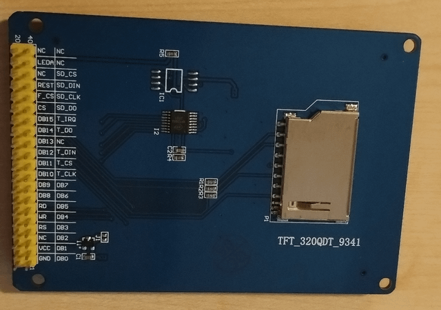
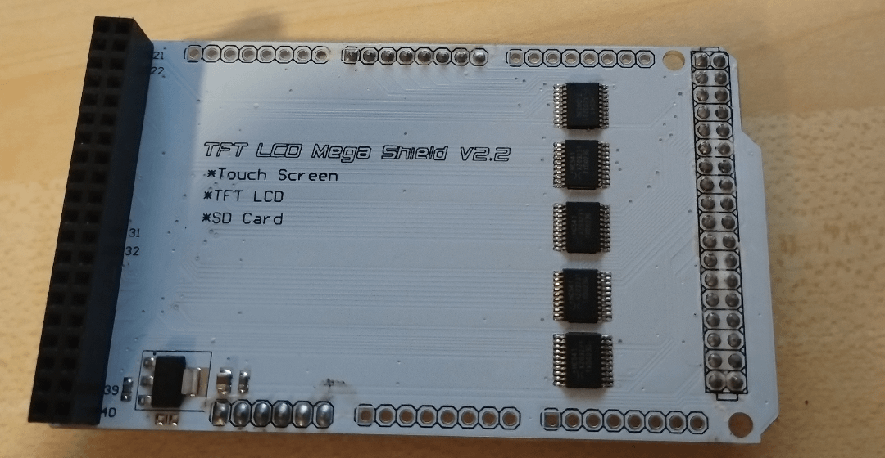

# mega_tft32_calibration

# Calibracao e Configuracao do Display TFT 3.2" com Touch no Arduino Mega 2560

Documentacao completa do processo de calibracao e configuracao do display
TFT 3.2" 240x320 com touch resistivo XPT2046 no Arduino Mega 2560, usando
o shield TFT LCD Mega Shield V2.2.

Este projeto foi criado como referencia independente devido a complexidade
do processo de configuracao, que envolveu identificacao de pinos, conflitos
de bibliotecas, problemas de timing e calibracao do touch.

---

## Hardware utilizado

| Componente       | Modelo                           | Observacao                    |
| ---------------- | -------------------------------- | ----------------------------- |
| Microcontrolador | Arduino Mega 2560 R3             | Placa principal               |
| Display          | TFT 3.2" 240x320 TFT_320QDT_9341 | Controlador grafico ILI9341   |
| Shield           | TFT LCD Mega Shield V2.2         | Adaptador para Arduino Mega   |
| Touch            | XPT2046                          | Chip de touch embutido no TFT |

---

## Especificacoes tecnicas

### Display TFT

  

| Especificacao       | Valor                       |
| ------------------- | --------------------------- |
| Tamanho             | 3.2" diagonal               |
| Resolucao           | 240 x 320 pixels            |
| Tipo                | LCD TFT colorido            |
| Controlador grafico | ILI9341                     |
| Profundidade de cor | 16 bits (65.536 cores)      |
| Interface display   | Paralelo 16 bits (8080)     |
| Controlador touch   | XPT2046                     |
| Interface touch     | SPI via pinos D2-D6 do Mega |
| Tensao logica       | 3.3V (shield faz conversao) |
| Backlight           | LEDs brancos                |
| Conector            | Flat cable 40 pinos         |

### Shield TFT LCD Mega V2.2

  

| Especificacao       | Valor                                   |
| ------------------- | --------------------------------------- |
| Compatibilidade     | Arduino Mega 2560                       |
| Suporte a displays  | TFT 2.4" e 3.2" em modo 8 ou 16 bits    |
| Conversao de nivel  | 5V para 3.3V via buffers 74HC541PW (x5) |
| Regulador de tensao | AMS1117-3.3V                            |
| Funcionalidades     | Touch Screen, TFT LCD, SD Card          |
| Pinos display       | D22-D41 (barramento paralelo 16 bits)   |
| Pinos touch         | D2=IRQ D3=OUT D4=DIN D5=CS D6=CLK       |
| Pinos SD card       | D42-D49                                 |
| Pinos SPI hardware  | D50-D53                                 |

---

## Montagem fisica

### Passo 1: encaixar o display no shield

1. Alinhe o flat cable de 40 pinos do display TFT com o conector
   do shield TFT LCD Mega Shield V2.2
2. Encaixe com cuidado verificando que todos os pinos estao alinhados
3. O display deve ficar fixo e nivelado sobre o shield

### Passo 2: encaixar o shield no Arduino Mega

1. Alinhe os headers do shield com os pinos do Arduino Mega 2560
2. Encaixe firmemente certificando que nenhum pino esta torto
3. O shield deve cobrir toda a extensao do Mega

### Verificacao do encaixe

- O backlight do display deve acender ao ligar o Mega
- Tela branca indica encaixe correto porem sem inicializacao do firmware
- Tela sem backlight indica problema no encaixe ou alimentacao

---

## Bibliotecas necessarias

### UTFT v2.83

- Autor: Henning Karlsen (Rinky-Dink Electronics)
- Download: rinkydinkelectronics.com
- Instalacao: manual (nao disponivel no Library Manager)

Estrutura correta apos instalacao:

    Documents/Arduino/libraries/UTFT/UTFT.h
    Documents/Arduino/libraries/UTFT/UTFT.cpp
    Documents/Arduino/libraries/UTFT/memorysaver.h
    Documents/Arduino/libraries/UTFT/hardware/avr/HW_AVR_defines.h

### URTouch

- Autor: Henning Karlsen (Rinky-Dink Electronics)
- Download: rinkydinkelectronics.com
- Instalacao: manual (nao disponivel no Library Manager)

Estrutura correta apos instalacao:

    Documents/Arduino/libraries/URTouch/URTouch.h
    Documents/Arduino/libraries/URTouch/URTouch.cpp
    Documents/Arduino/libraries/URTouch/URTouchCD.h

---

## Inicializacao correta do display

### Construtor funcional

Foram testados dois construtores para o display. Ambos funcionam:

    UTFT myGLCD(CTE32_R2, 38, 39, 40, 41);   // opcao 1
    UTFT myGLCD(ILI9341_16, 38, 39, 40, 41);  // opcao 2 - recomendada

O construtor ILI9341_16 e recomendado por ser mais especifico para o
controlador real do display.

### Motivo da tela branca inicial

O display retorna ID 0x0404 quando lido pela biblioteca MCUFRIEND_kbv,
indicando um controlador write-only. Isso causou semanas de tela branca
ate identificar o construtor correto via UTFT.

### Inicializacao em modo LANDSCAPE

    myGLCD.InitLCD(LANDSCAPE);

Essencial para que as coordenadas do touch coincidam com o display.

---

## Identificacao dos pinos do touch

### Processo de identificacao

A identificacao dos pinos corretos do touch foi um dos maiores desafios
do projeto. O processo envolveu:

1. Analise do esquematico oficial do TFT LCD Mega Shield V2.2
2. Varredura de todos os pinos digitais (D2-D53) com INPUT_PULLUP
3. Varredura de todos os pinos analogicos (A0-A15)
4. Testes com multiplas combinacoes de pinagem

### Resultado

Os pinos do touch XPT2046 no shield V2.2 sao os pinos digitais D2-D6
do Arduino Mega, confirmados pelo esquematico no conector J19:

| Sinal XPT2046 | Pino Mega | Funcao               |
| ------------- | --------- | -------------------- |
| T_IRQ         | D2        | Interrupt Request    |
| T_OUT / DOUT  | D3        | Saida de dados SPI   |
| T_DIN / DDIN  | D4        | Entrada de dados SPI |
| T_CS  / DCS   | D5        | Chip Select          |
| T_CLK / DCLK  | D6        | Clock SPI            |

Construtor URTouch correto:

    URTouch myTouch(6, 5, 4, 3, 2);
    //              CLK CS DIN OUT IRQ

---

## Calibracao do touch

### Executar o sketch de calibracao

1. Na Arduino IDE acesse:
   File > Examples > URTouch > URTouch_Calibration
2. Grave no Mega
3. Siga as instrucoes na tela tocando nos pontos indicados
4. Ao final anote os valores exibidos na tela

### Valores obtidos na calibracao

    CAL_X 0x03c10080UL
    CAL_Y 0x03C7C1A3UL
    CAL_S 0x000EF13FUL

### Atualizar o arquivo URTouchCD.h

Abra o arquivo:

    C:\Users\SEU_USUARIO\Documents\Arduino\libraries\URTouch\URTouchCD.h

Substitua os valores existentes pelos valores obtidos na calibracao.

### Valores reais lidos apos calibracao

Mesmo apos a calibracao, os valores raw lidos pelo XPT2046 nao cobrem
o range completo de 0-319 e 0-239. Os valores reais observados foram:

    Eixo X: minimo ~24, maximo ~302
    Eixo Y: minimo ~10, maximo ~227

Esses valores devem ser usados no mapeamento manual descrito adiante.

---

## Problemas encontrados e solucoes

### Problema 1: tela branca

Sintoma: display ligado (backlight aceso) mas sem exibir nada.

Causa: biblioteca e construtor incorretos para o controlador do display.

Solucao: usar UTFT v2.83 oficial com construtor ILI9341_16 ou CTE32_R2.

    UTFT myGLCD(ILI9341_16, 38, 39, 40, 41);

---

### Problema 2: caracteres estranhos na tela

Sintoma: texto exibido como simbolos ou caracteres invalidos.

Causa: sprintf("%.1f", valor) gera saida invalida no compilador AVR-GCC
quando usado com a UTFT no Arduino Mega.

Solucao: converter float para string manualmente:

    int parte_int = (int)valor;
    int parte_dec = (int)((valor - parte_int) * 10);
    if (parte_dec < 0) parte_dec = -parte_dec;
    sprintf(buf, "%d.%d", parte_int, parte_dec);

---

### Problema 3: touch nao detectado

Sintoma: nenhum toque detectado, biblioteca nao inicializa.

Causas encontradas:

- Mal contato no encaixe do shield ou display
- Pinagem incorreta na inicializacao da URTouch
- Interferencia de outros jumpers conectados ao Mega

Solucao:

- Verificar encaixe fisico do shield e display
- Usar pinagem confirmada: URTouch myTouch(6, 5, 4, 3, 2)
- Desconectar outros componentes para teste isolado

---

### Problema 4: coordenadas travadas nos cantos (efeito de quadrantes)

Sintoma: touch detecta toques mas as coordenadas retornam apenas os
valores dos cantos da tela, como se a tela fosse dividida em 4
quadrantes fixos.

Causa raiz (identificada apos investigacao detalhada):
O barramento paralelo de 16 bits da UTFT (pinos D22-D41) conflita em
timing com a leitura SPI da URTouch (pinos D2-D6). Quando o codigo
tenta usar a UTFT para desenhar na tela ao mesmo tempo em que a URTouch
tenta ler os pinos, a comunicacao paralela de 16 bits do display
atropela os pinos digitais do touch, fazendo os valores saturarem nos
cantos da tela.

Prova do diagnostico: em testes isolados sem operacoes de display,
o XPT2046 variou linearmente de ~24 a ~302 no eixo X e de ~10 a ~227
no eixo Y, respondendo perfeitamente aos limites fisicos da tela.

Solucao:

1. Adicionar delay(5) antes das operacoes de desenho apos leitura do touch

2. Adicionar delay(150) apos as operacoes de desenho

3. Usar mapeamento manual com os valores reais lidos pelo XPT2046:
   
    xReal = map(xRaw, 24, 302, 0, 319);
    yReal = map(yRaw, 10, 227, 0, 239);

---

### Problema 5: orientacao e mapeamento incorretos

Sintoma: circulos ou pontos aparecendo em posicao errada ao tocar.

Causa: o touch XPT2046 e o display ILI9341 usam orientacoes diferentes
de eixos quando em modo LANDSCAPE.

Solucao: inicializar ambos em LANDSCAPE e usar mapeamento manual
com os valores raw reais do sensor.

    myGLCD.InitLCD(LANDSCAPE);
    myTouch.InitTouch(LANDSCAPE);

---

## Licença

O código-fonte de todos os projetos neste repositório é distribuido sob
a licenca MIT. Consulte o arquivo LICENSE para mais detalhes.

---

## Autor

**Orlando Castro** Florianopolis, Santa Catarina, Brasil

Desenvolvedor de software com interesse em sistemas embarcados, IoT,
automacao e analise de dados.
