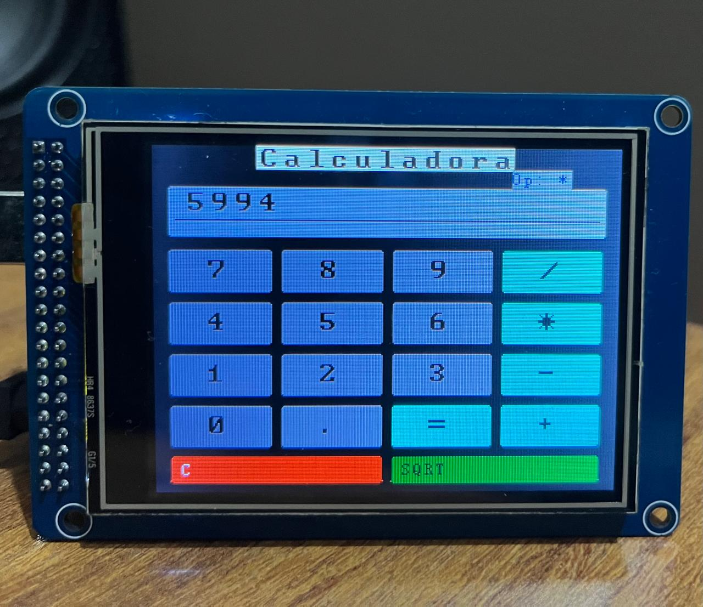

# mega_tft32_touch_calculator


<p align="center">
  
</p>

Calculadora touch desenvolvida com Arduino Mega 2560, display TFT 3.2" colorido e touch resistivo, com suporte às quatro operações matemáticas básicas e raiz quadrada. O projeto reutiliza a mesma base de hardware já validada em testes anteriores com display ILI9341 e controlador de toque XPT2046, incluindo os ajustes práticos de calibração e temporização entre UTFT e URTouch.

Este projeto foi pensado para servir como exemplo de interface gráfica embarcada orientada a toque em Arduino. Além da lógica de cálculo, ele demonstra desenho de botões na tela, mapeamento de coordenadas do touch para pixels do display, atualização parcial da área de resultado e tratamento de erros como divisão por zero e raiz quadrada de número negativo.

## Objetivo

Construir uma calculadora touch simples, estável e totalmente local, usando Arduino Mega e display TFT 3.2", com foco em:

- Interface gráfica desenhada diretamente no display.
- Entrada por toque em botões virtuais.
- Operações de soma, subtração, multiplicação, divisão e raiz quadrada.
- Base de código fácil de expandir para novos recursos, como botão de apagar, memória e histórico de operação.

## Hardware utilizado

| Componente      | Descrição                                                 |
| --------------- | --------------------------------------------------------- |
| Placa principal | Arduino Mega 2560.                                        |
| Display         | TFT 3.2" 240x320 com controlador ILI9341.                 |
| Touch           | Painel resistivo com controlador XPT2046.                 |
| Shield          | TFT LCD Mega Shield v2.2 usado no conjunto com o display. |
| Alimentação     | Via USB ou fonte compatível com o Arduino Mega.           |

## Bibliotecas utilizadas

O firmware foi estruturado com bibliotecas clássicas da família UTFT/URTouch, pois esse conjunto já havia sido validado com o hardware usado neste repositório.

- `UTFT` — responsável pelo desenho da interface gráfica, caixas, botões, linhas e textos no display.
- `URTouch` — responsável pela leitura do painel touch resistivo e obtenção das coordenadas RAW do toque.
- `math.h` — usada para a função `sqrt()` na operação de raiz quadrada.

## Ligações e configuração

O projeto foi desenvolvido sobre o mesmo conjunto já identificado anteriormente no repositório: display TFT_320QDT_9341 de 3.2", ligado ao Arduino Mega por shield paralelo, com touch resistivo XPT2046 acessado pela biblioteca URTouch.

A configuração de software adotada no sketch foi:

```cpp
UTFT myGLCD(ILI9341_16, 38, 39, 40, 41);
URTouch myTouch(6, 5, 4, 3, 2);
```

Esses parâmetros seguem a configuração prática já testada no ambiente do projeto, incluindo o uso do touch pelos pinos 6, 5, 4, 3 e 2 no Mega.

## Interface da calculadora

A interface gráfica foi organizada em duas áreas principais:

1. Área superior para exibição do valor atual e do operador selecionado.
2. Grade de botões touch para os dígitos e operações.

A distribuição dos botões adotada na versão funcional foi:

| Linha | Botões             |
| ----- | ------------------ |
| 1     | `7`, `8`, `9`, `/` |
| 2     | `4`, `5`, `6`, `*` |
| 3     | `1`, `2`, `3`, `-` |
| 4     | `0`, `.`, `=`, `+` |
| 5     | `C`, `SQRT`        |

Esse layout segue um padrão simples e eficiente para projetos de calculadora touch com Arduino, facilitando o mapeamento das áreas clicáveis e a manutenção do código.

## Lógica de funcionamento

A lógica interna foi mantida propositalmente simples para garantir estabilidade no Arduino Mega. Em vez de processar expressões matemáticas completas, o código trabalha com:

- Valor atual digitado pelo usuário.
- Valor armazenado da operação anterior.
- Operador matemático pendente.
- Estado de nova entrada.

Quando o usuário toca em um número, esse caractere é acrescentado ao valor atual exibido no visor. Ao tocar em um operador, o valor atual é armazenado e o sistema passa a aguardar o segundo operando. Ao pressionar `=`, a operação pendente é executada e o resultado é mostrado no display.

A tecla `SQRT` aplica a função de raiz quadrada diretamente sobre o valor atualmente exibido, usando `sqrt()` da biblioteca padrão de matemática do Arduino/C++.

## Mapeamento do touch

A leitura do touch é feita em coordenadas RAW, que precisam ser convertidas para coordenadas reais da tela. A implementação foi baseada nos valores de calibração já obtidos anteriormente para esse conjunto de hardware, com mapeamento aproximado nos seguintes intervalos:

```cpp
xReal = map(xRaw, 24, 302, 0, 319);
yReal = map(yRaw, 10, 227, 0, 239);
```

Após o mapeamento, os valores são limitados com `constrain()` para evitar coordenadas fora da área útil da tela. Essa abordagem foi adotada porque os testes anteriores mostraram que o hardware do touch estava funcional, mas havia necessidade de compatibilizar corretamente leitura, orientação e temporização entre as bibliotecas.

## Ajustes importantes implementados

Durante a finalização do projeto, alguns refinamentos de interface foram necessários para melhorar a usabilidade do firmware:

- Reposicionamento do título da aplicação para evitar que ficasse parcialmente escondido pela caixa do visor, conforme observado no teste visual do protótipo.
- Ajuste da coordenada vertical do texto principal do visor para melhor alinhamento dentro da área de resultados.
- Limpeza da área do operador antes de redesenhar `Op: +`, `Op: -`, `Op: *` ou `Op: /`, evitando sobreposição visual entre estados sucessivos.
- Manutenção do fundo do texto com `setBackColor(...)` compatível com a cor do display, para impedir rastros de caracteres antigos durante a atualização.

Esses ajustes foram importantes porque, em interfaces gráficas embarcadas sem compositor gráfico, cada elemento precisa ser redesenhado manualmente quando muda de estado.

## Tratamento de erros

A versão atual do firmware trata pelo menos dois casos importantes de erro:

- Divisão por zero, que exibe estado de erro no visor em vez de tentar realizar uma operação inválida.
- Raiz quadrada de valor negativo, que também gera erro controlado no display.

Esse comportamento torna o projeto mais previsível e evita resultados inválidos ou inconsistentes na interface.

## Estrutura sugerida no repositório

Uma organização recomendada para este projeto dentro do repositório é:

```text
mega_tft32_touch_calculator/
├── README.md
└── mega_tft32_touch_calculator.ino
```

Se desejar evoluir a documentação depois, também pode ser útil acrescentar:

```text
mega_tft32_touch_calculator/
├── README.md
├── mega_tft32_touch_calculator.ino
├── images/
│   └── calculadora-touch.jpg
└── docs/
    └── notas-de-calibracao.md
```

## Possíveis evoluções

A base atual permite expandir o projeto com relativa facilidade. Algumas melhorias naturais para próximas versões são:

- Botão `DEL` para apagar o último dígito.
- Botão `+/-` para alternar sinal do número atual.
- Histórico da operação no topo do display.
- Ajustes estéticos de fonte, cores e espaçamento dos botões.
- Memória de cálculo (`M+`, `M-`, `MR`, `MC`).

## Conclusão

O `mega_tft32_touch_calculator` é um projeto simples, útil e didático porque combina interface gráfica, leitura touch, lógica de processamento e refinamento visual em um único firmware. Ele também consolida o aprendizado obtido na calibração do conjunto Mega + TFT 3.2" + XPT2046, reaproveitando uma configuração que já se mostrou funcional e estável em testes anteriores.
