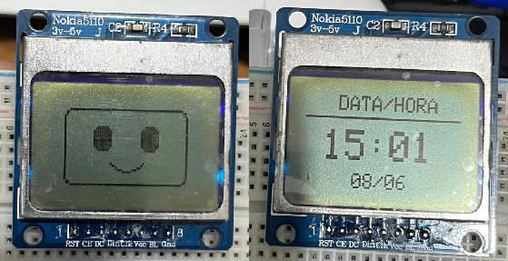
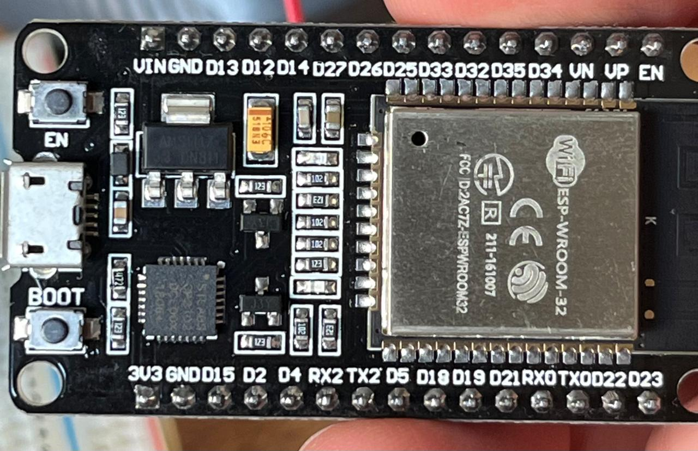
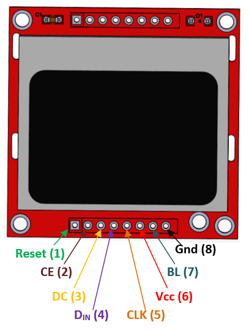
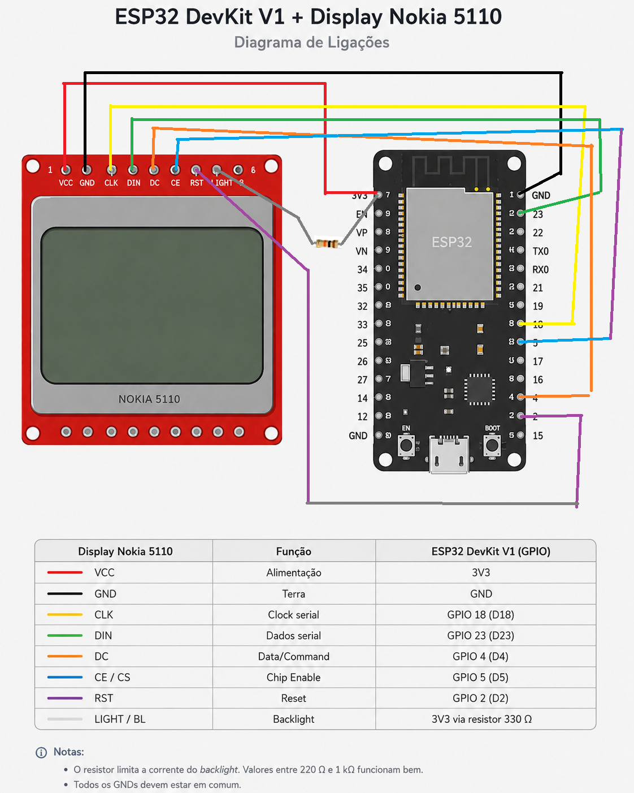

# Painel Informativo com ESP32 DevKit V1 + Nokia 5110

Projeto de um painel informativo com **ESP32 DevKit V1** e **display Nokia 5110 (PCD8544)** para exibir, em ciclo automático, um rostinho animado, data e hora via NTP e temperatura com ícone de clima obtidos pela API Open-Meteo. O display Nokia 5110 usa o controlador PCD8544, interface serial compatível com SPI e alimentação de 3,3 V, adequada ao ESP32.

<div>
<p align="center">
  
</p>
</div>

## Funcionalidades

- Tela 1: rostinho animado por 10 segundos.
- Tela 2: data e hora via NTP por 10 segundos.
- Tela 3: temperatura em °C e ícone do clima por 10 segundos.
- Ciclo contínuo entre as três exibições.
- Wi‑Fi para sincronização de hora e consulta meteorológica.

## Hardware utilizado

- ESP32 DevKit V1.
  
  <div>
  <p align="center">
    
  </p>
  </div>

- Display Nokia 5110 / PCD8544 84x48 pixels.
  
  <div>
  <p align="center">
    
  </p>
  </div>

- Protoboard e jumpers.

- Resistor para o backlight do display; no ajuste validado neste projeto, um resistor de 20 kΩ reduziu a intensidade da iluminação de forma satisfatória para uso de mesa, mas você pode usar outros entre 220 e 330 Ω também. Lembre-se apenas que o Diplay Nokia 5110 deve ser alimentado com 3,3V.

## Ligações

| Display Nokia 5110 | Função       | ESP32 DevKit V1  |
| ------------------ | ------------ | ---------------- |
| VCC                | Alimentação  | 3V3              |
| GND                | Terra        | GND              |
| CLK                | Clock serial | GPIO 18 / D18    |
| DIN                | Dados serial | GPIO 23 / D23    |
| DC                 | Data/Command | GPIO 4 / D4      |
| CE / CS            | Chip Enable  | GPIO 5 / D5      |
| RST                | Reset        | GPIO 2 / D2      |
| LIGHT / BL         | Backlight    | 3V3 via resistor |

A sequência de pinos do módulo Nokia 5110 pode variar conforme o fabricante, mas uma pinagem comum é `RST, CE, DC, DIN, CLK, VCC, BL, GND`; por isso, a serigrafia do próprio módulo deve sempre ser conferida antes da montagem.

## Esquema textual

```text
ESP32 DevKit V1              Display Nokia 5110 (PCD8544)
---------------------------------------------------------
3V3 -----------------------> VCC
GND -----------------------> GND
GPIO18 / D18 -------------> CLK
GPIO23 / D23 -------------> DIN
GPIO4  / D4  -------------> DC
GPIO5  / D5  -------------> CE/CS
GPIO2  / D2  -------------> RST
3V3 --[resistor]---------> LIGHT/BL
```

<div>
<p align="center">
  
</p>
</div>

## Bibliotecas necessárias

Instalar pela Arduino IDE: 

- Adafruit GFX Library.
- Adafruit PCD8544 Nokia 5110 LCD library.
- ArduinoJson.

## APIs utilizadas

### Hora via NTP

A sincronização de data e hora pode ser feita com `configTime()` e um servidor NTP, como `pool.ntp.org`, abordagem comum em projetos ESP32 com Arduino IDE.

### Clima via Open-Meteo

O Open-Meteo fornece dados atuais como `temperature_2m` e `weather_code` por requisição HTTP GET em JSON, sem necessidade de autenticação para uso não comercial.

Exemplo de endpoint:

```text
https://api.open-meteo.com/v1/forecast?latitude=-27.5954&longitude=-48.5480&current=temperature_2m,weather_code&timezone=auto
```

## Lógica de exibição

O display Nokia 5110 possui resolução de 84x48 pixels, o que torna mais eficiente alternar entre telas do que tentar mostrar todas as informações simultaneamente.

Ciclo adotado:

1. Rostinho animado — 10 s.
2. Data e hora — 10 s.
3. Temperatura e ícone do clima — 10 s

## Mapeamento simplificado do clima

O `weather_code` retornado pela API pode ser traduzido para ícones simples, adequados à tela monocromática pequena:

- `0` = sol.
- `1`, `2`, `3` = nublado ou parcialmente ensolarado.
- `51`, `53`, `55`, `61`, `63`, `65`, `80`, `81`, `82` = chuva.

## Possíveis problemas

### O backlight acende, mas a tela não mostra nada

As causas mais comuns são contraste inadequado, pinagem do módulo diferente da esperada, ou problema físico de contato no display.

### Como validar o display antes do projeto principal

Usar um sketch mínimo com texto e padrão gráfico é a forma mais segura de confirmar a biblioteca, a pinagem e o display antes de depurar Wi‑Fi, NTP ou API.

### Ajuste de contraste

O valor ideal de `display.setContrast()` varia entre módulos; ajustes entre 45 e 70 costumam ser necessários em displays PCD8544.

## Próximos passos que você pode implentar

- Adicionar quarta tela com cotação USD/BRL.[cite:25]
- Incluir ícone de “parcialmente ensolarado” com sol atrás da nuvem.
- Criar uma caixa impressa em 3D para o painel.
- Adicionar controle por botão para trocar manualmente a tela.
