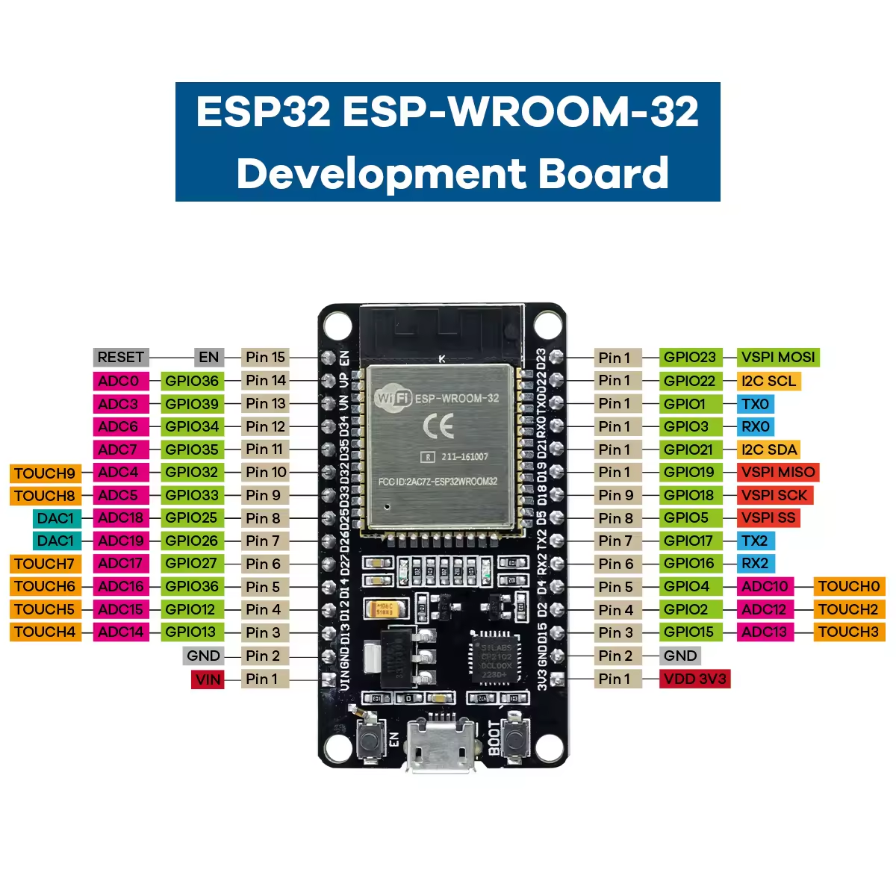

# Estacao Meteorologica Completa

# Arduino Mega 2560 + TFT 3.2" + DHT11 + ESP32

Estacao meteorologica com exibicao de dados locais (temperatura e umidade
via DHT11) e dados externos (clima, cotacao do dolar e hora NTP) obtidos
pelo ESP32 via Wi-Fi e enviados ao Arduino Mega por comunicacao serial.

---

## Funcionalidades

- Temperatura e umidade locais via sensor DHT11
- Hora real sincronizada via NTP (sem RTC fisico)
- Temperatura e umidade externas via API OpenWeatherMap
- Cotacao do dolar (USD/BRL) via AwesomeAPI
- Descricao do clima no rodape da tela
- Atualizacao da hora a cada 1 segundo
- Atualizacao dos dados externos a cada 30 segundos
- Atualizacao do sensor local a cada 5 segundos
- Interface grafica colorida no TFT 3.2" 240x320

---

## Arquitetura do sistema

    [ESP32] -- Serial UART --> [Mega 2560 + TFT 3.2"]
       |                              |
       |-- Wi-Fi                      |-- DHT11 (temp/umid local)
       |-- NTP (hora real)            |-- Relogio via NTP
       |-- OpenWeatherMap             |-- Display TFT
       |-- AwesomeAPI (dolar)

## Hardware utilizado

| Componente       | Modelo                           | Observacao                  |
| ---------------- | -------------------------------- | --------------------------- |
| Microcontrolador | Arduino Mega 2560 R3             | Controlador principal       |
| Microcontrolador | ESP32 DevKit V1 30 pinos         | Modulo Wi-Fi e APIs         |
| Display          | TFT 3.2" 240x320 TFT_320QDT_9341 | Controlador ILI9341         |
| Shield display   | TFT LCD Mega Shield V2.2         | Adaptador para Arduino Mega |
| Sensor           | DHT11                            | Temperatura e umidade local |

---

## Bibliotecas

### Arduino Mega

| Biblioteca              | Instalacao                            |
| ----------------------- | ------------------------------------- |
| UTFT v2.83              | Manual - site Rinky-Dink Electronics  |
| DHT sensor library      | Arduino Library Manager (by Adafruit) |
| Adafruit Unified Sensor | Arduino Library Manager (by Adafruit) |

### ESP32

| Biblioteca  | Instalacao                                   |
| ----------- | -------------------------------------------- |
| WiFi        | Incluida no ESP32 Arduino Core               |
| HTTPClient  | Incluida no ESP32 Arduino Core               |
| ArduinoJson | Arduino Library Manager (by Benoit Blanchon) |
| time.h      | Incluida no ESP32 Arduino Core               |

## Ligacoes

### Display TFT + Shield

O display TFT_320QDT_9341 e encaixado no TFT LCD Mega Shield V2.2,
que por sua vez e encaixado no Arduino Mega 2560.
Nenhuma fiacao adicional e necessaria para o display.

Construtor UTFT:

    UTFT myGLCD(CTE32_R2, 38, 39, 40, 41);

### Sensor DHT11

O shield TFT cobre o pino de 5V e os GNDs do Mega.
Solucao: alimentar o DHT11 via pinos digitais configurados como OUTPUT.

| Pino DHT11 | Pino Mega 2560 | Observacao           |
| ---------- | -------------- | -------------------- |
| VCC        | Pino 8         | OUTPUT HIGH como VCC |
| GND        | Pino 11        | OUTPUT LOW como GND  |
| DATA       | Pino 14        | Sinal de dados       |

### Comunicacao ESP32 -> Mega (UART Serial)

| Pino ESP32   | Pino Mega 2560 | Observacao          |
| ------------ | -------------- | ------------------- |
| TX2 (GPIO17) | Pino 19 (RX1)  | TX ESP32 -> RX Mega |
| RX2 (GPIO16) | Pino 18 (TX1)  | RX ESP32 -> TX Mega |
| GND          | Pino 11        | GND compartilhado   |

Velocidade serial: 9600 baud em ambos os lados.

  

## Protocolo de comunicacao

O ESP32 envia duas categorias de mensagens ao Mega via serial:

Pacote completo (a cada 30 segundos):

    NTP:20:35:00;TEMP_EXT:22.5;UMID_EXT:68;DESC:Nublado;USD:5.21\n

Pacote de hora (a cada 1 segundo):

    HORA:20:35:01\n

O Mega faz o parsing linha a linha usando \n como terminador
e ; como separador de campos.

---

## APIs utilizadas

### OpenWeatherMap

- Site: openweathermap.org
- Plano: gratuito (ate 1000 chamadas/dia)
- Dados: temperatura, umidade, descricao do clima
- Requer cadastro e API Key gratuita

### AwesomeAPI

- Site: economia.awesomeapi.com.br
- Plano: gratuito, sem API Key
- Dados: cotacao USD/BRL (bid)
- Endpoint: https://economia.awesomeapi.com.br/json/last/USD-BRL

---

## Configuracao do ESP32

Edite antes de gravar:

    const char* ssid     = "SEU_WIFI";
    const char* password = "SUA_SENHA";
    const String OWM_KEY  = "SUA_API_KEY";
    const String OWM_CITY = "Florianopolis,BR";

Fuso horario configurado para UTC-3 (Brasilia/Florianopolis):

    const long gmtOffset = -3 * 3600;

## Layout da tela

    +--------------------------------------------------+
    |              Estacao Meteo                       |
    +--------------------------------------------------+
    |                  20:35:42                        |
    +----------+----------+-----------+---------------+
    |  TEMP    |  UMID    |   TEMP    |   UMID        |
    |  LOCAL   |  LOCAL   |  EXTERNO  |  EXTERNO      |
    |  25.2    |   54     |   22.5    |    68         |
    |  grC     |    %     |   grC     |     %         |
    +----------+----------+-----------+---------------+
    |  USD/BRL              R$ 5.21                   |
    +--------------------------------------------------+
    | Nublado                                          |
    +--------------------------------------------------+

---

## Notas tecnicas

### Bug do sprintf com float no AVR/Mega

    sprintf("%.1f", valor) gera caracteres invalidos na UTFT com AVR-GCC.
    Conversao manual adotada:
    
    int parte_int = (int)valor;
    int parte_dec = (int)((valor - parte_int) * 10);
    if (parte_dec < 0) parte_dec = -parte_dec;
    sprintf(buf, "%d.%d", parte_int, parte_dec);

### Alimentacao do DHT11 via pinos digitais

    Shield TFT ocupa o 5V e GNDs do Mega.
    Solucao: pinos digitais como VCC e GND:
    - Pino 8:  OUTPUT HIGH (VCC - DHT11 usa ~2.5mA)
    - Pino 11: OUTPUT LOW  (GND)

### GPIO16 e GPIO17 no ESP32 DevKit V1 30 pinos

    Marcados como TX2 e RX2 na serigrafia, lado direito da placa,
    proximos ao GND e 3V3 na extremidade inferior (lado do USB).

### Construtor do display

    Display retorna ID 0x0404 (write-only).
    Unico construtor funcional: CTE32_R2 na UTFT v2.83.

## Estrutura do repositorio

    mega-tft32-esp32-weather/
    ├── firmware/
    │   ├── mega/
    │   │   └── estacao_mega_esp32.ino
    │   └── esp32/
    │       └── estacao_esp32.ino
    └── README.md

---

## Sequencia de inicializacao

1. Grave o firmware no Mega
2. Grave o firmware no ESP32
3. Ligue o Mega primeiro - tela mostra "Aguardando ESP32..."
4. Ligue o ESP32 em seguida
5. Aguarde ate 30 segundos para o primeiro pacote completo
6. Tela atualiza com todos os dados externos

---

## Proximos passos planejados

- [ ] Touch screen para navegacao entre telas
- [ ] Modulo RTC DS3231 para hora offline
- [ ] Grafico historico de temperatura
- [ ] Alertas de temperatura e umidade

---

## Licenca

Distribuido sob a licenca MIT.
Consulte o arquivo LICENSE na raiz do repositorio.

---

## Autor

Orlando Castro
Florianopolis, Santa Catarina, Brasil
